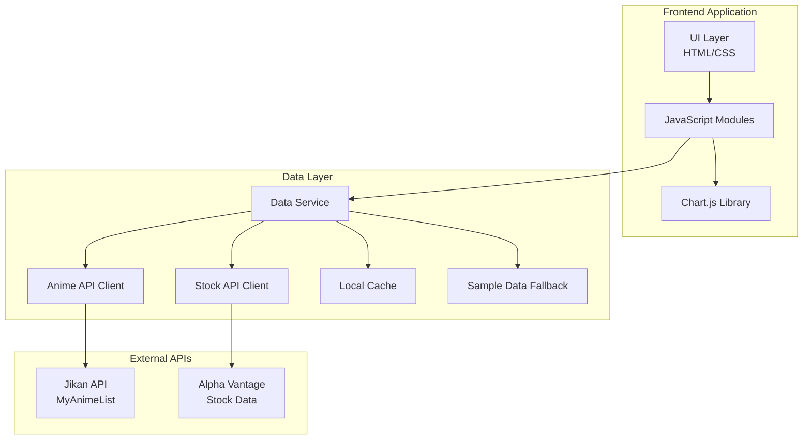

# Design Document

## Overview

The Anime Trends vs AWS Stock Dashboard is a single-page web application that visualizes the correlation between anime popularity metrics and AWS/AMZN stock performance. Built with vanilla HTML, CSS, and JavaScript, the dashboard delivers a visually stunning experience that blends anime aesthetics (neon gradients, glassmorphism, animated elements) with professional financial dashboard functionality.

The application fetches data from public APIs (with fallback to curated sample data), processes it to find correlations, and renders interactive charts and KPI cards. The design prioritizes visual impact, smooth animations, and responsive behavior to create an award-winning user experience.

## Architecture



## Components and Interfaces

### 1. HTML Structure Components

```
index.html
├── Header
│   ├── Logo (anime-styled with AWS cloud icon blend)
│   ├── Title
│   └── Last Updated Timestamp
├── KPI Section
│   ├── Anime Trend Cards (top 3 trending)
│   └── Stock Metric Cards (price, change, volume)
├── Main Chart Section
│   ├── Time Range Filter Buttons
│   └── Dual-Axis Time Series Chart
├── Correlation Section
│   ├── Correlation Coefficient Display
│   ├── Scatter Plot
│   └── Insights Panel
├── Loading Overlay
└── Error Modal
```

### 2. CSS Architecture

```
styles/
├── main.css           # Core layout and variables
├── components.css     # Card, button, chart container styles
├── animations.css     # Keyframe animations and transitions
└── responsive.css     # Media queries for responsiveness
```

**Design Tokens:**

- Primary gradient: `linear-gradient(135deg, #667eea 0%, #764ba2 100%)`
- Accent neon: `#00f5ff` (cyan), `#ff00ff` (magenta), `#ffff00` (yellow)
- Background: `#0a0a0f` (deep dark)
- Glass effect: `rgba(255, 255, 255, 0.05)` with `backdrop-filter: blur(10px)`
- AWS Orange accent: `#ff9900`

### 3. JavaScript Modules

```
js/
├── app.js             # Main application entry, orchestration
├── dataService.js     # API fetching and data processing
├── chartManager.js    # Chart.js configuration and rendering
├── uiController.js    # DOM manipulation and animations
├── correlation.js     # Statistical correlation calculations
└── sampleData.js      # Fallback sample datasets
```

### Interfaces

```typescript
// Data Interfaces (conceptual - implemented in JS)

interface AnimeDataPoint {
  date: string; // ISO date string
  title: string; // Anime title
  popularity: number; // Popularity score (0-100 normalized)
  members: number; // Community members/watchers
  score: number; // Rating score
}

interface StockDataPoint {
  date: string; // ISO date string
  open: number; // Opening price
  high: number; // Daily high
  low: number; // Daily low
  close: number; // Closing price
  volume: number; // Trading volume
}

interface CorrelationResult {
  coefficient: number; // Pearson correlation (-1 to 1)
  significance: string; // "strong", "moderate", "weak", "none"
  insight: string; // Human-readable insight text
}

interface DashboardState {
  timeRange: "1W" | "1M" | "3M" | "1Y";
  animeData: AnimeDataPoint[];
  stockData: StockDataPoint[];
  correlation: CorrelationResult;
  isLoading: boolean;
  error: string | null;
  lastUpdated: Date;
}
```

## Data Models

### Anime Trend Data Model

| Field      | Type   | Description                         |
| ---------- | ------ | ----------------------------------- |
| date       | string | Date of the data point (YYYY-MM-DD) |
| title      | string | Name of the trending anime          |
| popularity | number | Normalized popularity score (0-100) |
| members    | number | Number of community members         |
| score      | number | Average user rating (0-10)          |
| rank       | number | Current popularity rank             |

### Stock Data Model

| Field  | Type   | Description               |
| ------ | ------ | ------------------------- |
| date   | string | Trading date (YYYY-MM-DD) |
| open   | number | Opening price in USD      |
| high   | number | Daily high price          |
| low    | number | Daily low price           |
| close  | number | Closing price in USD      |
| volume | number | Trading volume            |
| change | number | Daily change percentage   |

### Correlation Data Model

| Field       | Type   | Description                     |
| ----------- | ------ | ------------------------------- |
| coefficient | number | Pearson correlation coefficient |
| pValue      | number | Statistical significance        |
| dataPoints  | number | Number of compared points       |
| insight     | string | Generated insight text          |

## Correctness Properties

_A property is a characteristic or behavior that should hold true across all valid executions of a system-essentially, a formal statement about what the system should do. Properties serve as the bridge between human-readable specifications and machine-verifiable correctness guarantees._

### Property 1: Data Alignment by Date

_For any_ two datasets (anime trends and stock data) with overlapping date ranges, the alignment function SHALL produce paired data points where each pair contains data from the exact same date, and no dates present in both source datasets are omitted from the result.

**Validates: Requirements 1.2, 5.3**

### Property 2: Tooltip Data Retrieval

_For any_ valid date that exists in both datasets, the tooltip data function SHALL return an object containing the correct anime popularity value and stock closing price for that specific date.

**Validates: Requirements 1.3**

### Property 3: Top Anime KPI Extraction

_For any_ non-empty anime dataset, the KPI extraction function SHALL return the top N anime sorted in descending order by popularity score, where each returned item has a popularity score greater than or equal to all items not returned.

**Validates: Requirements 3.1**

### Property 4: Stock KPI Calculation

_For any_ stock dataset with at least two data points, the KPI calculation function SHALL correctly compute the daily change percentage as `((current_close - previous_close) / previous_close) * 100` and determine trend direction as positive when change > 0, negative when change < 0, and neutral when change = 0.

**Validates: Requirements 3.2**

### Property 5: Percentage Color Coding

_For any_ numeric percentage value, the color determination function SHALL return green for values > 0, red for values < 0, and neutral/gray for values equal to 0.

**Validates: Requirements 3.4**

### Property 6: Time Range Filtering

_For any_ dataset and valid time range selection, the filter function SHALL return only data points whose dates fall within the specified range (inclusive), and the result SHALL be sorted chronologically.

**Validates: Requirements 4.1**

### Property 7: Correlation Coefficient Calculation

_For any_ two numeric arrays of equal length (n ≥ 2), the correlation function SHALL compute the Pearson correlation coefficient within the range [-1, 1], where 1 indicates perfect positive correlation, -1 indicates perfect negative correlation, and 0 indicates no linear correlation.

**Validates: Requirements 5.1**

### Property 8: Correlation Significance Classification

_For any_ correlation coefficient value, the classification function SHALL return "strong" for |r| ≥ 0.7, "moderate" for 0.4 ≤ |r| < 0.7, "weak" for 0.2 ≤ |r| < 0.4, and "none" for |r| < 0.2.

**Validates: Requirements 5.2**

### Property 9: Timestamp Formatting

_For any_ valid Date object, the formatting function SHALL produce a human-readable string containing the date and time components in a consistent format.

**Validates: Requirements 6.4**

### Property 10: Error Message Generation

_For any_ error type (network, parsing, timeout, unknown), the error message function SHALL return a non-empty, user-friendly string that does not expose technical details or stack traces.

**Validates: Requirements 7.2**

## Error Handling

### API Failure Handling

1. **Network Errors**: When API requests fail due to network issues, the system falls back to sample data and displays a subtle toast notification
2. **Rate Limiting**: If APIs return 429 status, the system uses cached data and schedules a retry after the specified cooldown
3. **Invalid Response**: Malformed API responses trigger fallback to sample data with error logging
4. **Timeout**: Requests exceeding 10 seconds are aborted and fallback data is used

### Data Validation

1. **Missing Fields**: Data points with missing required fields are filtered out during processing
2. **Invalid Dates**: Non-parseable dates are skipped with console warnings
3. **Out-of-Range Values**: Negative stock prices or popularity scores outside 0-100 are clamped or rejected

### UI Error States

1. **Loading Failure**: Display anime-themed error illustration with "Retry" button
2. **Partial Data**: Show available data with indicator for missing sections
3. **Chart Render Failure**: Display fallback message with data table alternative

## Testing Strategy

### Unit Testing

Unit tests will be written using a lightweight testing approach with console assertions for this vanilla JS project. Tests will cover:

- Data transformation functions
- Date parsing and formatting utilities
- KPI calculation functions
- Filter logic

### Property-Based Testing

Property-based tests will use **fast-check** library to verify universal properties across generated inputs.

**Configuration:**

- Minimum 100 iterations per property test
- Custom arbitraries for anime and stock data generation

**Test File Structure:**

```
tests/
├── correlation.property.test.js    # Properties 7, 8
├── dataAlignment.property.test.js  # Properties 1, 2
├── kpi.property.test.js            # Properties 3, 4, 5
├── filtering.property.test.js      # Property 6
├── formatting.property.test.js     # Properties 9, 10
└── test-runner.html                # Browser-based test runner
```

**Property Test Annotation Format:**
Each property test will be tagged with:

```javascript
// **Feature: anime-aws-dashboard, Property 1: Data Alignment by Date**
// **Validates: Requirements 1.2, 5.3**
```

### Integration Testing

Manual integration tests will verify:

- Full data flow from API to chart rendering
- Time range filter interactions
- Responsive behavior across viewport sizes
